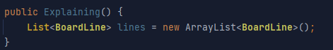
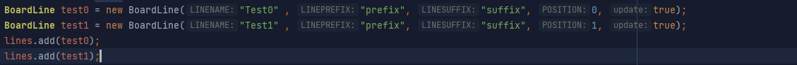

# ScoreboardAPI
This is a small libary that will make it easier to create updating scoreboards :) (not tested yet)

# How does it work?

It uses a list of BoardLine Objects and puts these values into teams and sorts Listthem trough a list of chat colours into a board.
Its pretty easy and still allows for updating and non updating lines with just three lines of code.

# How do i use it?

First you need a list with BoardLine`s:

Then you need to add lines to the board:

Now you can create the boards:

AND now you are done :).
The Api will do the rest for you and you will have a good functioning board for you plugin or server :)

# Cooming soon:
Using own Objectives(Could come in handy when you are doing a prefix plugin with tab sort :))
